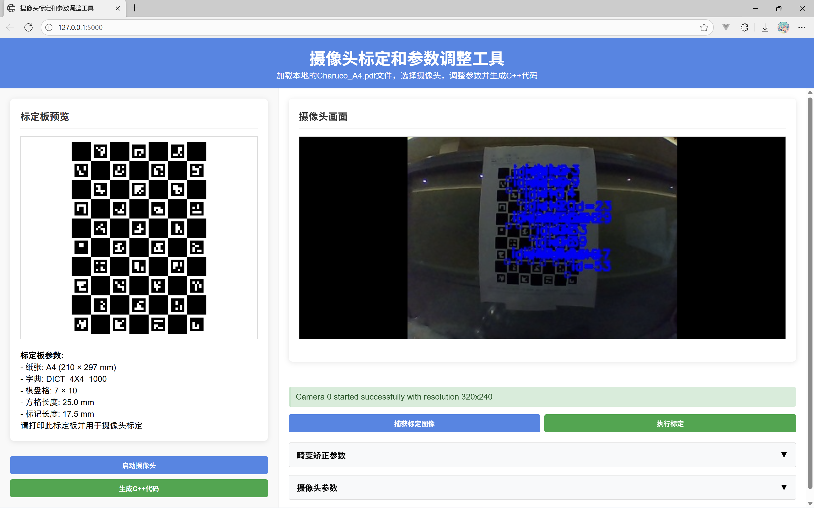

# 摄像头标定和参数调整工具 - 黑金主题版

这是一个基于WebUI的摄像头标定和参数调整工具，用于摄像头畸变校正和参数优化。项目使用Python + Flask作为后端，WebUI作为前端界面。前端采用现代化的黑金配色主题，界面美观且专业。

## 效果展示



## 功能特性

- **多种标定板支持**：支持ChArUco标定板和棋盘格标定板
- **摄像头管理**：自动检测可用摄像头，支持参数调整
- **实时预览**：实时显示摄像头画面，叠加检测到的标定板角点
- **参数调整**：调整摄像头参数（分辨率、帧率、曝光模式、曝光值等）
- **畸变校正**：支持针孔模型和鱼眼模型的摄像头标定
- **参数可视化**：实时应用畸变校正参数预览效果
- **标定结果导出**：生成C++代码，支持标定结果保存为YAML文件
- **现代化UI**：采用黑金配色主题，界面美观专业

## 系统要求

- Python 3.7+
- OpenCV (包含aruco模块)
- Flask
- NumPy

## 使用教程

### 准备工作
- 准备标定板（打印[Charuco_A4.pdf](Charuco_A4.pdf)文件，为A4纸尺寸）
- 一颗摄像头
- Python环境（推荐使用Miniconda或Anaconda，亦或者UV）

### 安装软件及其环境

这里以Anaconda为例（Miniconda和Anaconda步骤完全相同）

- [Anaconda 下载](https://www.anaconda.com/download)
- [Anaconda 安装指南](https://zhuanlan.zhihu.com/p/1896337220048228723)

### 创建虚拟环境并进入

```bash
conda create -n fixCam python=3.11
conda activate fixCam
```

### 克隆仓库并进入目录
国内镜像：
```bash
git clone https://gitee.com/Magnetokuwan/cam_distortion_correction.git
cd cam_distortion_correction
```
或者Github：
```bash
git clone https://github.com/ouyangyanhuo/cam_distortion_correction
cd cam_distortion_correction
```

### 安装依赖

```bash
pip install -r requirements.txt
```

### 启动应用

```bash
python app.py
```

应用将在 `http://127.0.0.1:5000` 上运行。

### 使用流程

1. **准备标定板**：打印项目中的 [Charuco_A4.pdf](Charuco_A4.pdf) 或使用棋盘格标定板
2. **选择摄像头**：从下拉菜单中选择要标定的摄像头
3. **调整参数**：设置合适的分辨率、帧率和曝光参数
4. **捕获标定图像**：将标定板放置在不同角度和位置，点击"捕获标定图像"，建议至少捕获10张以上
5. **执行标定**：点击"执行标定"完成摄像头标定
6. **预览效果**：标定完成后可实时查看畸变校正效果
7. **导出结果**：可生成C++代码

## 项目结构

```
fixCam/
├── app.py                      # Flask主程序入口，提供Web API
├── requirements.txt            # 依赖库列表
├── Charuco_A4.pdf             # A4纸张ChArUco标定板
├── .gitignore                 # Git忽略配置
├── README.md                  # 说明文档
├── backend/                   # 后端模块
│   ├── __init__.py
│   ├── camera.py              # 摄像头管理模块
│   ├── board.py               # 标定板管理模块
│   └── calibration.py         # 标定核心算法模块
├── frontend/                  # 前端文件
│   ├── index.html             # Web界面
│   └── static/
│       ├── css/style.css      # 黑金主题样式
│       └── js/main.js         # 前端逻辑
└── PROJECT_STRUCTURE.md       # 项目结构文档
```

## 模块说明

### backend/camera.py
摄像头管理模块，包含摄像头初始化、参数调整、视频流处理等功能。

### backend/board.py
标定板管理模块，处理棋盘格和ChArUco标定板的生成和角点检测。

### backend/calibration.py
标定核心算法模块，实现针孔和鱼眼相机模型的标定算法。

### frontend/index.html
Web界面，采用现代化布局和黑金配色主题。

### frontend/static/css/style.css
前端样式文件，实现黑金主题设计。

### frontend/static/js/main.js
前端交互逻辑，与后端API通信。

### app.py
Flask应用主入口，提供API服务和静态文件服务。

## 技术细节

### 标定板参数

- **ChArUco标定板**：A4纸张，DICT_4X4_1000字典，7×10棋盘格，25.0mm方格长度，17.5mm标记长度
- **棋盘格标定板**：默认9×6内角点，25.0mm方格长度（可自定义）

### 支持的模型

- **针孔模型**：适用于大多数普通摄像头，支持k1, k2, p1, p2, k3五个畸变系数
- **鱼眼模型**：适用于广角摄像头，支持k1, k2, k3, k4四个畸变系数

### 标定结果

标定完成后会生成：
- 内参矩阵（3×3）
- 畸变系数向量
- 重投影误差（用于评估标定质量）

## 黑金主题特色

- **专业设计**：采用深色背景配合金色高亮，视觉效果专业高端
- **现代化界面**：响应式设计，适配不同屏幕尺寸
- **用户体验**：清晰的状态提示，直观的操作反馈
- **夜间友好**：深色主题减少眼部疲劳，适合长时间使用

## 开发说明

本项目已重构为前后端分离架构，前端采用现代化黑金主题设计。核心标定功能在 [backend/](backend/) 目录下的各个模块中实现，Flask应用提供Web界面和API接口。

## 注意事项

- 标定图像数量越多，标定结果越准确（建议至少10张）
- 标定板应在画面中清晰可见，避免反光或阴影
- 捕获标定图像时，应覆盖整个视野范围的不同位置和角度
- 标定完成后，重投影误差越小表示标定质量越高（通常应小于1.0像素）
- 不同的相机模型（针孔/鱼眼）会产生不同的标定结果，请根据实际摄像头类型选择
- 黑金主题设计在暗光环境下使用效果更佳